# MovieDB-Web
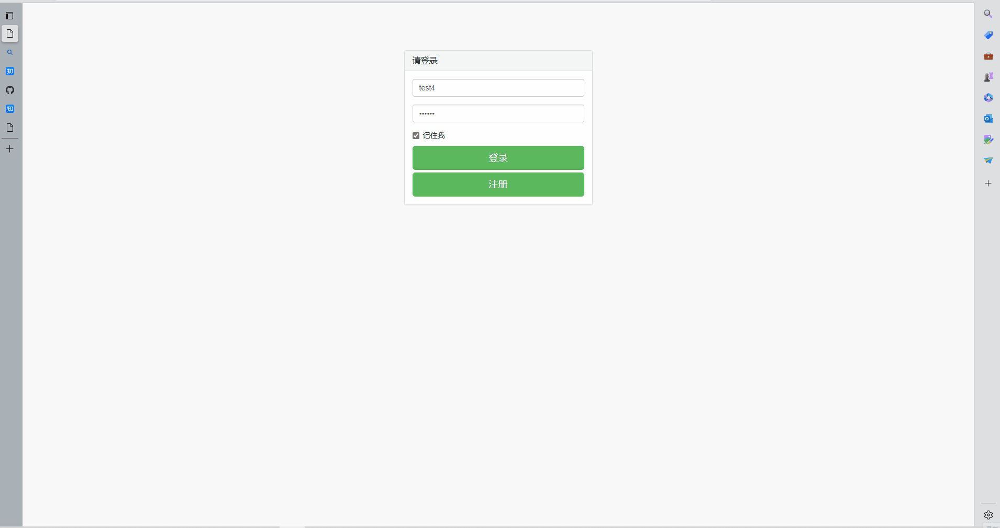

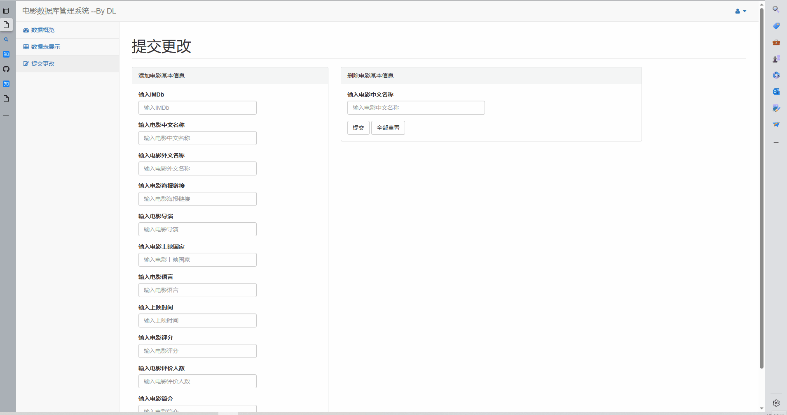
- [MovieDB-Web](#moviedb-web)
  - [一、安装环境（Windows 10）](#一安装环境windows-10)
  - [二、运行](#二运行)
  - [三、文件说明](#三文件说明)
  - [四、项目设计说明](#四项目设计说明)
    - [1. 简介](#1-简介)
    - [2. 需求分析](#2-需求分析)
    - [3. ER模型](#3-er模型)
    - [4. 关系模型和规范化](#4-关系模型和规范化)
      - [关系模型](#关系模型)
      - [规范化](#规范化)
    - [5. 表的创建](#5-表的创建)
    - [6. 数据库查询和触发器](#6-数据库查询和触发器)
      - [查询](#查询)
      - [触发器](#触发器)
    - [7. 总结](#7-总结)
  - [五、前端功能展示](#五前端功能展示)

更多信息查看GitHub仓库：https://github.com/DLee0102/MovieDB-Web
## 一、安装环境（Windows 10）
```cmd
pip install -r requirements.txt
```
## 二、运行
- 创建数据库（在创建自己的数据库前请先删除我提供的数据库，你也可以跳过创建数据库这一步而使用我提前创建好的数据库）
```cmd
python createdb.py
```
- 启动爬虫（可以选择跳过这一步而使用我提前爬取好的数据，若你重新创建了新的数据库则一定要运行这一步）
```cmd
python spider.py --datanum 50
```
- 启动flask（在我提供的数据库中，用户名dl，密码123000）
```cmd
python app.py
```
## 三、文件说明
- static/ --------------JS以及前端渲染文件
- templates/ ------------html界面文件
- app.py ----------------运行Flask框架的脚本
- createdb.py -----------创建数据库的脚本
- dbopt.py ------------一些操作数据库的函数
- spider.py -------------爬取电影数据的爬虫脚本
- doubanMovielinks.xlsx ------------爬取数据用的链接
- movie.db ------------数据库文件
- movie.sql --------------创建数据库的sql语句
- requirements.txt ----------------环境依赖

## 四、项目设计说明
### 1. 简介
- 本项目是一个基于Web的电影数据可视化和数据交互平台，实现了多种数据可视化和与后端数据交互两大功能。其中，数据可视化支持将后端数据统计后展示为折线图、柱形图和饼状图；数据交互支持将后端数据库数据分页展示在前端界面，并在前端提供动态查询功能，同时还支持便捷的数据插入和数据删除功能。除此之外，本项目还实现了界面登录功能。
- 本项目基于Python Flask框架开发，前端采用了html, css, JS, DataTables, Echarts等多种语言和技术框架；后端数据库技术基于sqlite框架，并开发了爬虫脚本来爬取数据库测试用数据。
### 2. 需求分析
- 本项目的目标用户是电影评论网站的后台管理员。原生的后端数据库技术如Mysql、sqlite等操作不够便捷，不具备数据可视化功能，这给后台数据库管理员的数据管理和数据分析工作带来了一定的困难。本项目针对这些需求，开发了一个操作便捷的前端界面，并提供了丰富的数据可视化和数据交互功能，来简化后台数据库管理员的工作流程。
### 3. ER模型
- UML图
  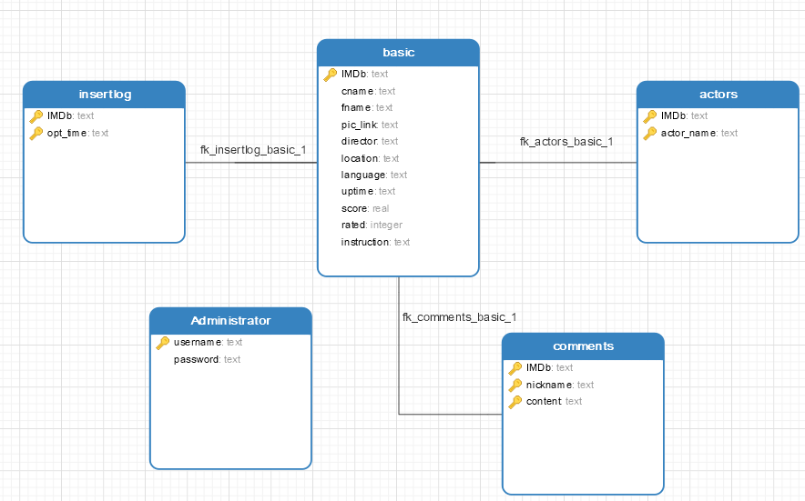
- ER图
  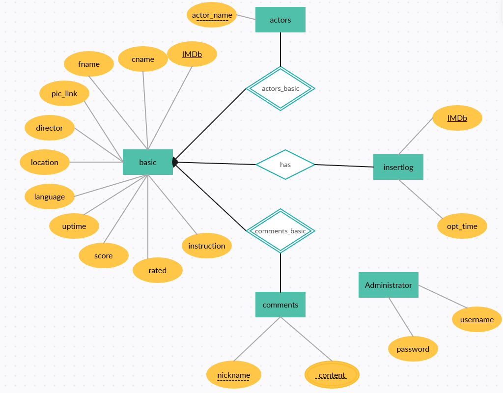
- 说明：
  - basic是基本电影信息，其作为一个强实体集拥有comments（电影评论信息）和actors（电影演员信息）两个弱实体集，这两个弱实体集是basic的多值属性；
  - insertlog记录的是basic表的插入日志信息，两者依靠一个触发器相关联；
  - Administrator是管理员信息；
### 4. 关系模型和规范化
#### 关系模型
- basic
  - 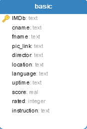
- comments
  - 
- actors
  - 
- insertlog
  - 
- Administrator
  - 
#### 规范化
- actors(IMDb, actor_name)：
  - IMDb, actor_name --> {IMDb, actor_name}, 满足BCNF范式
- Administrator(username, password)
  - username --> password, 满足BCNF范式
- basic(IMDb, cname, fname, pic_link, director, location, language, uptime, score, rated, instruction)
  - IMDb --> {cname, fname, pic_link, director, location, language, uptime, score, rated, instruction}, 满足BCNF范式
- comments(IMDb, nickname, content):
  - {IMDb, nickname, content} --> {IMDb, nickname, content}, 满足BCNF范式
- insertlog(IMDb, opt_time):
  - {IMDb, opt_time} --> {IMDb, opt_time}, 满足BCNF范式


### 5. 表的创建
sql语句创建表格如下：
```sql
CREATE TABLE "actors" (
  "IMDb" text NOT NULL,
  "actor_name" text NOT NULL,
  PRIMARY KEY ("IMDb", "actor_name"),
  CONSTRAINT "fk_actors_basic_1" FOREIGN KEY ("IMDb") REFERENCES "basic" ("IMDb") ON DELETE CASCADE
);

CREATE TABLE "Administrator" (
  "username" text NOT NULL,
  "password" text NOT NULL,
  PRIMARY KEY ("username")
);

CREATE TABLE "basic" (
  "IMDb" text NOT NULL,
  "cname" text NOT NULL,
  "fname" text,
  "pic_link" text NOT NULL,
  "director" text NOT NULL,
  "location" text NOT NULL,
  "language" text NOT NULL,
  "uptime" text NOT NULL,
  "score" real NOT NULL,
  "rated" integer NOT NULL,
  "instruction" text NOT NULL,
  PRIMARY KEY ("IMDb")
);
CREATE TRIGGER "insert_log"
AFTER INSERT
ON "basic"
BEGIN
  INSERT INTO insertlog(IMDb, opt_time) VALUES (new.IMDb, datetime('now'));
END;

CREATE TABLE "comments" (
  "IMDb" text NOT NULL,
  "nickname" text NOT NULL,
  "content" text NOT NULL,
  PRIMARY KEY ("IMDb", "nickname", "content"),
  CONSTRAINT "fk_comments_basic_1" FOREIGN KEY ("IMDb") REFERENCES "basic" ("IMDb") ON DELETE CASCADE
);

CREATE TABLE "insertlog" (
  "IMDb" text NOT NULL,
  "opt_time" text NOT NULL,
  PRIMARY KEY ("opt_time", "IMDb"),
  CONSTRAINT "fk_insertlog_basic_1" FOREIGN KEY ("IMDb") REFERENCES "basic" ("IMDb") ON DELETE CASCADE
);
```
### 6. 数据库查询和触发器
#### 查询
- 向Administrator表中插入值（注册时用）
```sql
insert into Administrator (
    username,
    password
)values (%s)
```
- 检索Administrator目录（登录时用）
```sql
select * from Administrator where username = (%s) and password = (%s)
```
- 拿出指定表的所有行数据
```sql
select * from (%s)
```
- 向basic表中插入数据
```sql
insert into basic (
    IMDb,
    cname,
    fname,
    pic_link,
    director,
    location,
    language,
    uptime,
    score,
    rated,
    instruction
)values (%s)
```
- 从basic表中删除值
```sql
delete from basic where cname = (%s)
```
- 统计电影评分
```sql
select score, count(score) from basic group by score
```
- 统计电影上映时间
```sql
select uptime, count(uptime) from basic group by uptime
```
- 统计电影上映地区
```sql
select location, count(location) from basic group by location
```
#### 触发器
- 用于记录向basic表中插入值的日志信息，并保存到insertlog表
```sql
CREATE TRIGGER "insert_log"
AFTER INSERT
ON "basic"
BEGIN
  INSERT INTO insertlog(IMDb, opt_time) VALUES (new.IMDb, datetime('now'));
END;
```
### 7. 总结
- 我通过这个项目第一次自己动手设计了一个比较完整的数据库，对数据库设计原理和技巧有了更深入的了解。同时，我在编写项目代码的过程中用到了多种技术和框架，在学习这些技术的过程中我的代码能力、知识检索能力和与人沟通的能力得到了进一步提升，这对我而言是一次宝贵的项目经历。
## 五、前端功能展示
1. 登录功能（可通过浏览器缓存记住账号密码）
   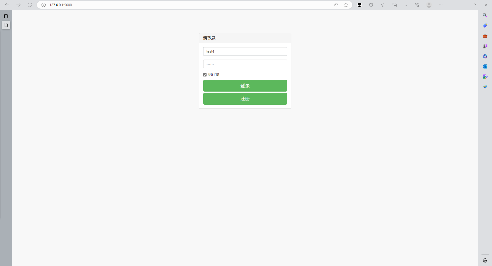
   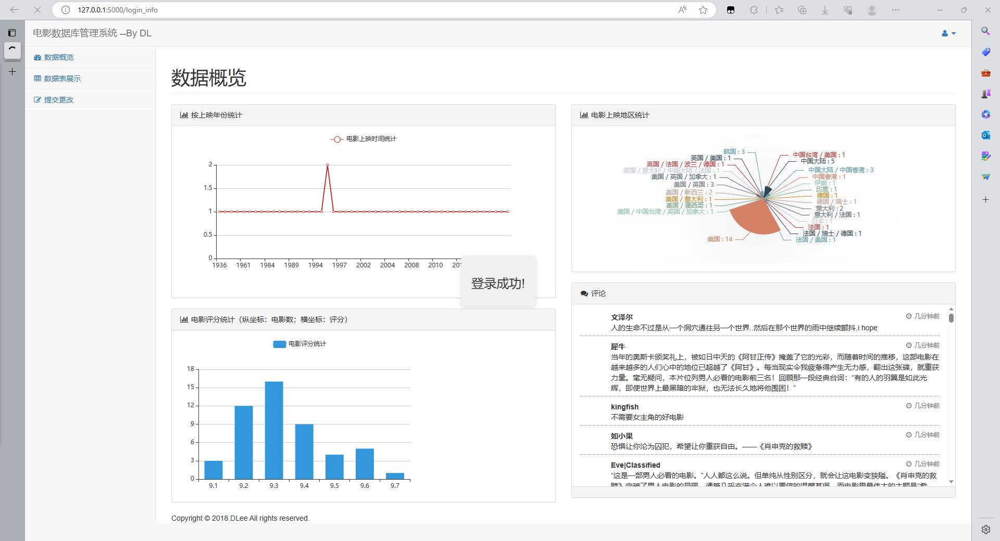
2. 注册功能
   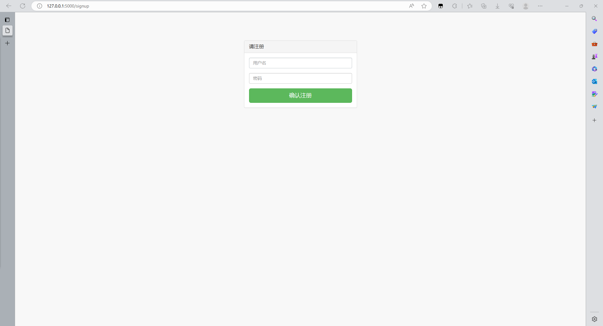
3. 数据可视化功能
   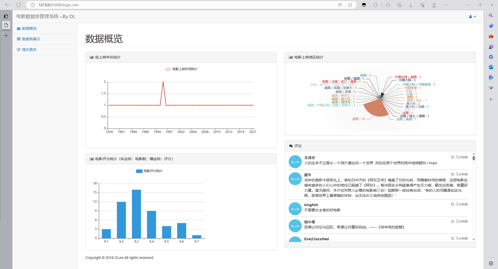
4. 数据库展示功能（提供前端实时检索）
   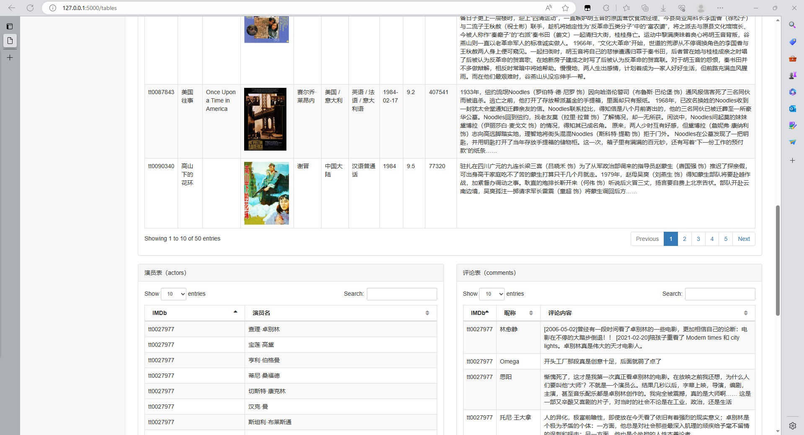
   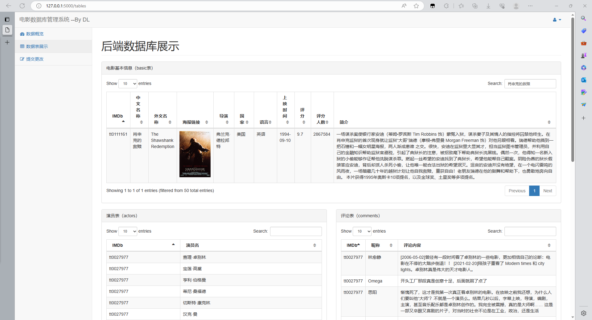
5. 数据库交互功能
   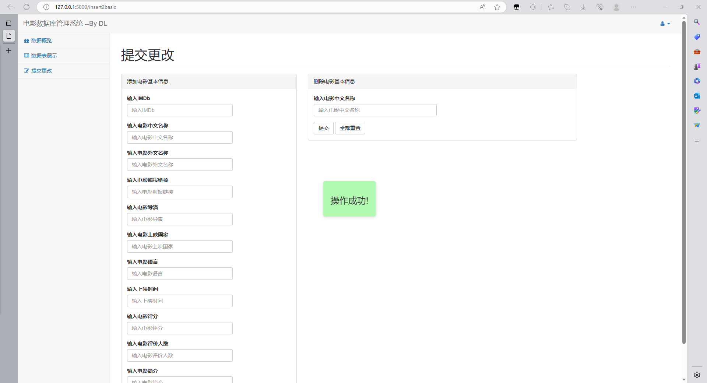
更多信息查看GitHub仓库：https://github.com/DLee0102/MovieDB-Web
